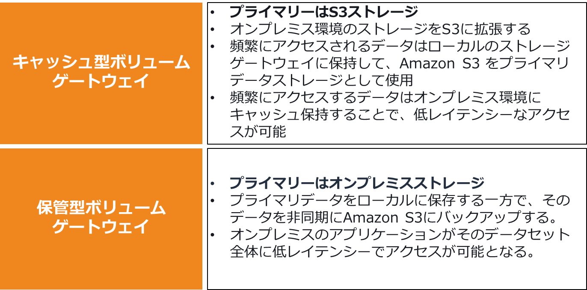

## 初耳サービスまとめ

1. AWS Control Tower  
2. AWS CAF  
3. Amazon GuardDuty  
AWSアカウント、EC2、コンテナアプリケーション、S3に保存されたデータを保護するために  
悪意のあるアクティビティや不正な行動をモニタリングする脅威検出サービス  
4. AWS Config  
AWSリソースの変更を記録し、設定履歴を確認する  
設定するとEC2インスタンスやオンプレミスのソフトウェアの設定変更を記録できる  
5. Amazon Inspector  
脆弱性スキャンしてくれるサービス  

## 自分向け覚書

### Amazon EBSとAmazon EFSの違い

・データの保存形式  
EBS：ブロックストレージでEC2にアタッチする  
EFS：ファイルストレージでEC2にマウントする  
・アクセス  
EBS：1つのEC2インスタンスにしかアタッチできない  
EFS：複数のEC2インスタンスにマウントできる  

## 模擬試験で不正解だったもの

1. AWSクラウド上でIaaSを利用するメリット  
自分の回答：インフラ管理の柔軟性  
正解：オンデマンドによる柔軟性  
IaCとごっちゃになったのとオンデマンドという単語のみで除外した。  
オンデマンド（On Demand）とは、英語で「要求（Demand）に応じて」という意味  

2. 1ヶ月だけキャンペーンサイトを運用する際のEC2インスタンス購入オプション  
自分の回答：スポットインスタンス  
正解：オンデマンドインスタンス  
リザーブドインスタンスは1年、3年の固定契約
スケジュールドリザーブドインスタンスは日次、週次、月次の固定契約  
中長期間の運用予定のバッチ処理で利用する  
スポットインスタンスはAWSが管理する未使用のEC2インスタンスを格安利用できるが  
途中で停止されるリスクがあり、本問題の1ヶ月は長すぎるため不適切  

3. EC2インスタンス間でのファイル共有する仕組み  
自分の回答：Amazon EBS  
正解：Amazon EFS  
基本的にはEBSでマウントするが、EFSは共有ファイルストレージサービスなのでこちらが適切  

4. EC2インスタンスへのSSHの22番ポートを許可したSGをモニタリングして  
不必要にポートが許可されないように監視する仕組み  
自分の回答：AWS GuardDuty  
正解：AWS Config  
SGの設定変更を記録するのはAWS Config  

5. 柔軟で弾力性があるクラウドアーキテクチャの原則に基づいた設計  
自分の回答：疎結合なコンポーネント間結合を実施する  
正解：需要に応じたスケーリングを自動化する  
弾力性と書かれているのでスケーリングの話  

6. 請求額が上限に達したことを通知するための仕組み  
自分の回答：請求ダッシュボード  
正解：CloudWatch +  SNS  
そもそも請求ダッシュボードなんてないらしい(なかったっけ？)  
Cloudwatchはlog、みたいな先入観があった  

7. 数か月間利用しないアプリケーションのEC2インスタンス設定によって発生する課金を最小限にする  
自分の回答：インスタンスを停止する  
正解：AMIを作成してインスタンスを削除する  
インスタンスを停止してもEBSは課金されるから  

8. リソース変更をモニタリングする仕組み  
自分の回答：AWS Control Tower  
正解：AWS Config  

9. EC2にアクセスするために何を利用すればよいか  
自分の回答：Amazon Connect、SSHソフトウェア  
正解：AWS Systems Manager Session Manager、SSHソフトウェア  
SSMは覚えてたけどそれがSession Managerだと思わなかった(AWSSMSMじゃん...)  

10. 週1回、10分程度のバッチ処理要件を満たすために最適なAWSサービス  
自分の回答：AWS Fargate  
正解：AWS Lambda  
Fargateでバッチ実行すると思ってたけどLambdaの方が適切  
10分をlambdaで動かすのは長くね？と思ったけどそうらしい  

11. AWSにデータを保存するうえでのセキュリティ上のメリット  
自分の回答：ユーザー側でデータセキュリティの対応をしなくても保護が自動的に実施される  
正解：ユーザーは自身のデータを完全に制御することができる

12. 本番稼働サービスの中断が発生した場合のサポートが必要な場合に利用するサポートサービス
自分の回答：AWS パートナーパスに本番システムダウンのサポートを依頼する
正解：AWS サポートプランのビジネスプラン
ここでサポートプランがまとめられている
少なくともAWSパートナーパスはAPNに参加している会社が登録できる仕組みで別物なので選びたくなかった
AWS サポートプラン | プランを比較し、技術支援を受け、専門家の指導を受ける
<https://aws.amazon.com/jp/premiumsupport/plans/>

13. 特定のユーザーが利用したサービスの利用料金を把握するためのサービス
自分の回答：Cost Explorer
正解：AWS コストと使用状況レポート
ちなみにAWS CURらしい

14. Well Architected Frameworkの基本原則
・オペレーショナルエクセレンス（運用上の優秀性）
・セキュリティ
・信頼性
・パフォーマンス効率
・コスト最適化
・持続可能性
AWS Well-Architected – 安全で効率的なクラウドアプリケーション
<https://aws.amazon.com/jp/architecture/well-architected/?wa-lens-whitepapers.sort-by=item.additionalFields.sortDate&wa-lens-whitepapers.sort-order=desc&wa-guidance-whitepapers.sort-by=item.additionalFields.sortDate&wa-guidance-whitepapers.sort-order=desc>

15. 高速フェイルオーバーを備えた可用性の高い構成を実現するためのサービス
自分の回答：Amazon CloudFront
正解：AWS Global Accelerator
AWS Global Acceleratorは世界中に向けて提供するアプリの可用性とパフォーマンスを向上させるサービス

16. 155TBのデータをAWSへ移行する際のデバイスの組み合わせが最適か
自分の回答：AWS Snowball 1台
正解：AWS Snowball Edge Storage Optimized 2台
AWS Snowballはすでに終了済み
AWS Snowball Edge Storage Optimizedは80TBor210TBのデータ移行を行える。
あれ？155TBなら1台でもよくないか？

17. EC2インスタンス内部の詳細情報を取得するためのCloudWatch設定方法
正解：
・ CloudWatchエージェントをEC2インスタンスにインストールする
・ 適切なIAMロールによってEC2インスタンスのメトリクスが取得できる設定を行う
CloudWatch Logsを設定するとログを取得できるが、メトリクスは取得できない

18. データの一部をオンプレミス環境に保持し、AWSネットワーク間との通信時に低レイテンシーなネットワークアクセスを実現するためのサービス
正解：AWS Outposts
AWS Local Zonesはレイテンシーの影響を受けやすいアップ理ケーションをエンドユーザーに近い場所で実行するサービス
AWS OutpostsはAWSサービスをオンプレミスで実行するためのサービス

19. AWS Trusted Advisorにより利用可能となる機能
正解：セキュリティ改善
AWS Trusted Advisorは、コストの最適化、パフォーマンスの向上、セキュリティと耐障害性の改善を支援する。
様々なカテゴリでベストプラクティスチェックを行う

20. AWS責任共有モデルにおいてユーザー固有の統制として必要な対応
自分の回答：意識とトレーニング
正解：ルーティング管理
セキュリティ環境内のデータのルーティング管理する必要がある
責任共有モデル | AWS
<https://aws.amazon.com/jp/compliance/shared-responsibility-model/>

21. オンプレミス環境にあるストレージをプライマリとしてAmazon S3に拡張する際のAWSサービス
正解：AWS Storage　Gatewayの保管型ボリュームゲートウェイ
特徴 - AWS Storage Gateway | AWS
<https://aws.amazon.com/jp/storagegateway/features/?nc=sn&loc=2&dn=1>
保管型とキャッシュ型の違い

22. AWS Organizationsを利用した複数アカウントの管理の特徴
正解：各アカウントのストレージボリュームを統合することで。S3コストを削減できる
組織内のすべてのアカウントの使用量を結合し、料金のボリューム割引、リザーブドインスタンスの割引、および Savings Plans を共有できます。
AWS Organizations の一括請求 (コンソリデーティッドビリング) - AWS 請求
<https://docs.aws.amazon.com/ja_jp/awsaccountbilling/latest/aboutv2/consolidated-billing.html>

23. 請求書やアカウントへの質問に対する迅速な対応が提供されるサポートサービス
正解：コンシェルジュサポート
AWSサポートのエンタープライズサポートプランに含まれるサービス
・請求およびアカウント照会への24/365アクセス
・請求割り当て、レポート、アカウント統合のベストプラクティスの提供
・支払いに関する問い合わせ
・特定の費用報告に関するトレーニングの提供
・サービス制限に関する支援
・一括購入の支援

24. Well Architected Frameworkの基本原則である信頼性原則として正しい内容
正解：障害への早期復旧
信頼性＝障害耐久性

25. 3年間以上の長期運用を行うEC2インスタンスで、インスタンスサイズを交換できることが必要
正解：リザーブドインスタンス(スタンダード)
スタンダートでは、以下の変更が可能
・インスタンスサイズ
・AZ
・ネットワークプラットフォーム（EC2-Classic、VPC）
26. AWSリソースへマルウェアが配信された際の連絡先
正解：AWS不正使用対策チーム

27. Amazon RDS MySQLの認証情報をローテーションするためのサービス
正解：AWS Sercrets Manager

28. AWS Trusted Advisorの全項目が利用可能なサポートプラン
正解：エンタープライズプラン、ビジネスプラン
29. データを大量に保存できる一元的リポジトリを提供するサービス
正解：AWS Lake Formation
