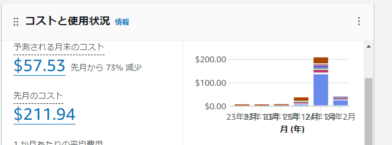

AWS EC2インスタンスで構築する。
AL2023はglibc.i686及びlibstdc++.i686を拾うのがめんどいのでAL2を使う。

<https://tech.palworldgame.com/dedicated-server-guide#linux>

[Link to SteamCMD](https://developer.valvesoftware.com/wiki/SteamCMD#Linux)

### サーバー設定

### よく使うコマンド

steamCMD
cd /home/ec2-user/Steam/

再起、停止、スタート、ステータス確認
sudo systemctl restart pal
sudo systemctl stop pal
sudo systemctl start pal
sudo systemctl status pal

### アップデート手順

cd /home/ec2-user/Steam/
./steamcmd.sh +login anonymous +app_update 2394010 validate +quit

引っかかったところメモ
・8GBだとボリューム不足で落ちる。

### 起動、停止用lambda構成

費用削減のため、起動、停止用のlambdaを作成した。
勉強代


起動用のlambda
環境変数にあらかじめインスタンスIDを設定しておく

``` python
import os
import sys
import boto3

import json

region = os.getenv('REGION', None)
instance = os.getenv('INSTANCE', None)
instances = []
instances.append(instance)

def lambda_handler(event, context):
    
    print('Hey man! I created Lambda function for the first time!!')
    
    ec2 = boto3.client('ec2', region_name=region)
    ec2.start_instances(InstanceIds=instances)
    
    return {
        'statusCode': 200,
        'body': json.dumps('Hello from Lambda!')
    }
```

停止用のlambda
環境変数に同じく...

``` pyhton
import os
import sys
import boto3

import json

region = os.getenv('REGION', None)
instance = os.getenv('INSTANCE', None)
instances = []
instances.append(instance)

def lambda_handler(event, context):
    
    print('Hey man! I created Lambda function for the first time!!')
    
    ec2 = boto3.client('ec2', region_name=region)
    ec2.stop_instances(InstanceIds=instances)
    
    return {
        'statusCode': 200,
        'body': json.dumps('Hello from Lambda!')
    }
```
