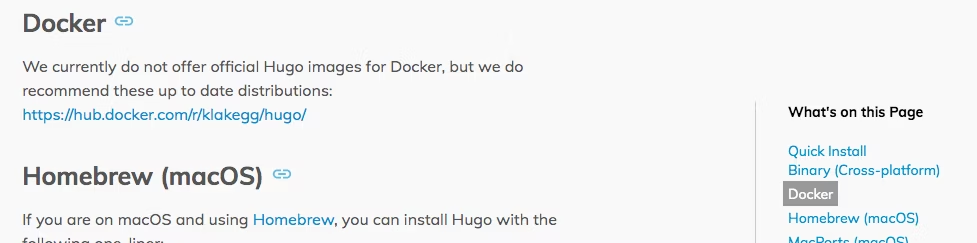
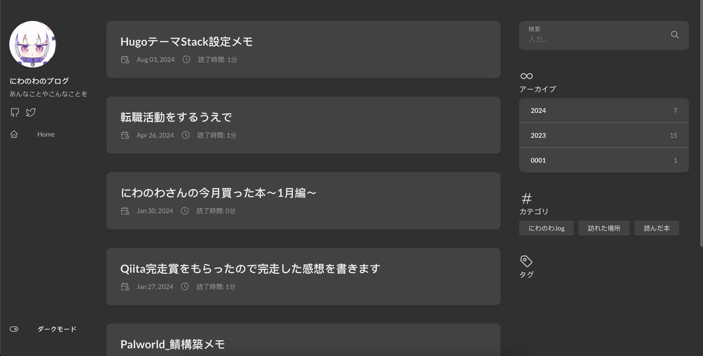
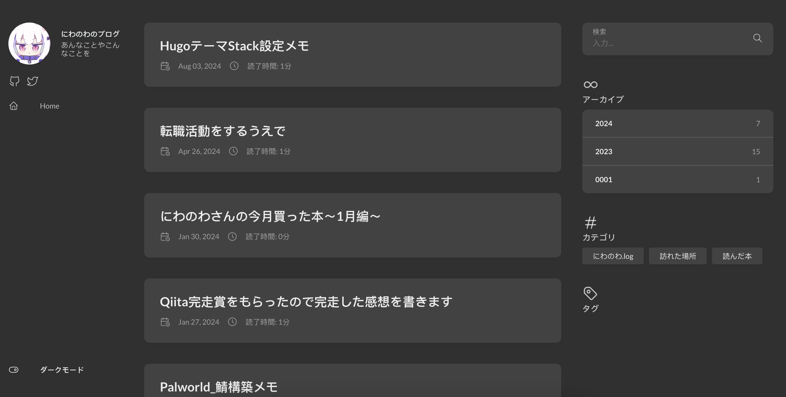
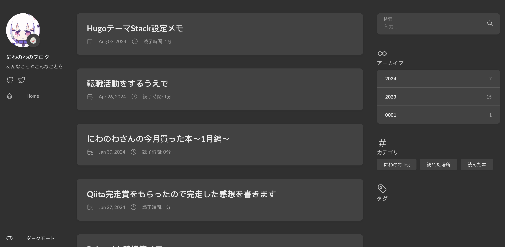
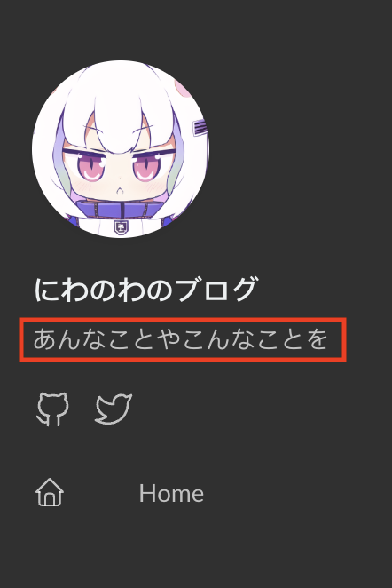
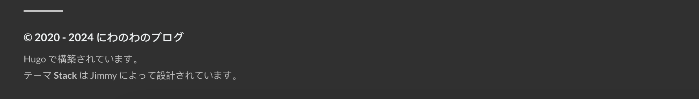
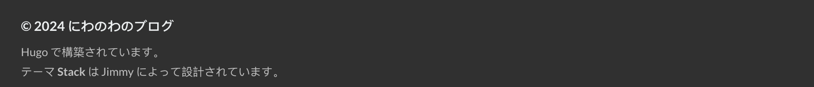

## はじめに

本サイトはhugoで運用されている。
気が向いたのでhugoのアップデートをしようとしたらdockerコンテナが公式から消えていて
ただアップデートするだけじゃなかったのでついでにテーマもPaperModからStackへ変更することにした。

[参考](https://qiita.com/ub0t0/items/4ac2f2d8c3e8fbdfcfad)：

## 基本設定

[スターターテンプレート](https://github.com/CaiJimmy/hugo-theme-stack-starter)のconfigディレクトリをコピーして上書きしていく。

[こちら](https://stack.jimmycai.com/config/site)が設定ドキュメント。

## 変更項目

### config.toml

1. baseurl
デフォルト : "<https://demo.stack.jimmycai.com>"
設定値 : "<https://hugo.niwanowa.tips/>"
ホストしたいとメインをば

2. languageCode
デフォルト : "en-us"
設定値 : "ja"
[こちら](https://gohugo.io/getting-started/configuration/#languagecode)参照。
RFC 5646準拠とのことだけど日本語ドキュメント読んでるし'''ja'''でいいんじゃないでしょうか

3. title
デフォルト : "Hugo Theme Stack Starter"
設定値 : "にわのわのブログ"

4. theme
デフォルト : 無し
設定値 : "stack"
スターターテンプレートだと記載してないけどどこでテーマ設定されてるんだ...?

### params.toml

1. mainSections
デフォルト : ["post"]
設定値 : ["posts"]
テーマ移行前がpostsだったので

2. favicon
デフォルト : "/favicon.png"
設定値 : "/favicon.ico"
設定例でstatic/favicon.icoだったら/favicon.icoって書いてねって書いてあるけど  
空欄のままでも表示されていた。一応書いておけ

3. sidebar
   1. compact
   デフォルト : false
    設定値 : true
    比較
    false
    
    true
    
   2. emoji
    デフォルト : "🍥"
    設定値 : 無し
    こんな感じで好きな絵文字をアイコンの右下に表示できる(画像参考)
    なくすこともできる。このサイトはこっち
    
   3. subtitle
    デフォルト : "Lorem ipsum dolor sit amet, consectetur adipiscing elit."
    設定値 : "あんなことやこんなことを"
    この部分(赤枠は編集)
    

4. avatar
   1. src
    デフォルト : "img/avatar.png"
    設定値 : "twittericon.png"
    画像のパスは/assets/{設定値}となる
    将来を考えてimgディレクトリを作っておくべきか？

5. footer
   1. since
    デフォルト : 2020
    設定値 : 無し
    このサイトの開設年を記載する部分
    設定値がintなので設定したくない場合はコメントアウトする。
    
    設定しないとこんな感じ
    
6. article
   1. toc
    デフォルト : なし
    設定値 : true
    サイドバー内に目次を表示する場合はtrueにするらしいけどデフォルトで設定はなくても表示されていた。一応trueにしておく。
   2. readingTime
    デフォルト : true
    設定値 : false
    タイトルの下に読了時間を表示するかどうか
    中身がないことをバラされないためにfalseにしておく。
   3. license.enabled
    デフォルト : true
    設定値 : false
    記事の下にライセンスを表示する
    フッターならtrueにしていた...
7. comments
   1. enabled
    デフォルト : true
    設定値 : false
    ここは僕のサイトだ
8. colorScheme
   1. toggle : false
   2. default : "dark"
    闇に生きるので

## アイコン追加

Stackは[Tabler Icons](https://tabler.io/icons)の一部をデフォルトで使えるようにしてくれている
旧twitterアイコンは含まれているが現アイコンは含まれていないのかったのでついでに全部のアセットを追加
Githubで公開されているのでsubmodulesで追加したりできそうなんだけどディレクトリ構成がちょいめんどいので直接置いている(技術不足)

## フォント変更

デフォルトだと中国語系フォントが設定されているので変更したい
[参考](https://hugo.ainoniwa.net/p/2022-10-31/)

## おわりに

とりあえずここまで、タグとかカテゴリーとかをちゃんとするきっかけとしたいのであえてwidgets.homepageはいじらなかった
頑張れ自分
