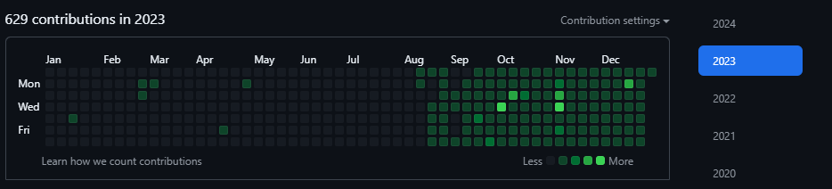
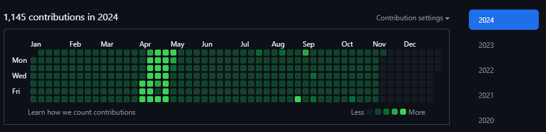
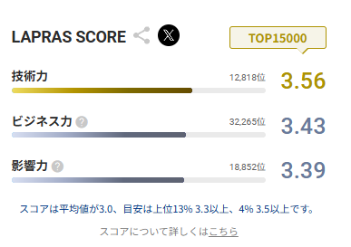
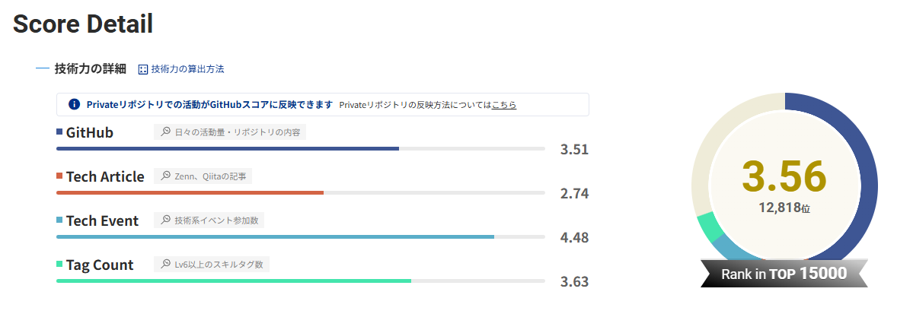
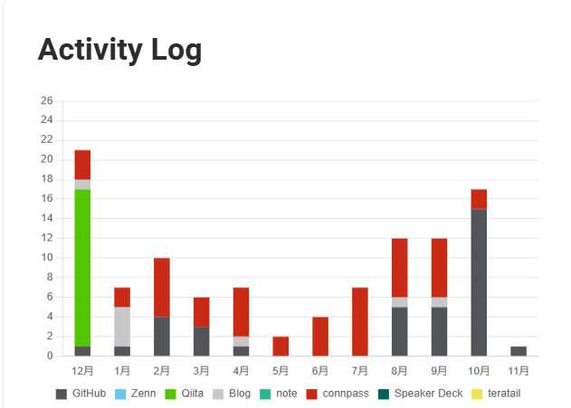

## はじめに

ここ1年くらいアウトプットを意識していたので、その頑張りを自慢します。

高専時代から「強いエンジニア」になることに憧れて、LTやコミュニティ活動、ハッカソンなどに積極的に参加してきました。しかし、社会人になってから引越しやコロナの影響で、リアルイベントに参加する機会が減り、アウトプットも停滞してしまいました。

そこで数年前に読んだ[全てのエンジニアに向けて「エンジニアとして生き残るために」](https://www.ntt.com/shines/posts/b-t_20201012.html)の内容を思い出し、「できる範囲」を超えて「できる限り」やってみようと一念発起。特に去年からはオフラインイベントも復活しつつあることもあり、意識的に行動量を増やしてみました。

## やったこと

### github

記事にもある[Write Code Every Day](https://johnresig.com/blog/write-code-every-day/)っすね。
自分の場合は○○100本ノックみたいなのだと慣れて惰性でやってしまって経験値効率が悪そうなので
できるだけ自分の作りたいものへのコミットや未知の技術書などの写経を意識していた。

### 参加したイベント

どうしてもオンラインイベントだとラジオ感覚になってしまいがちだったり、コミュニケーション(発言権)が取りづらかったりするので
オンラインイベントはudemyとか技術書とかをめくってる感覚かなと思っている。ので、なるたけオフラインイベントに参加することを意識していた。

オフラインイベント：41件
(登壇：8件、スタッフ：2件)
オンラインイベント：13件

### 読んだ本

Software Design 定期購読しておくといいよね
定期的に自分が選んでいない一定品質が担保された情報を接種することができる

ゼロからのOS自作入門

「技術書」読書術

Reactハンズオンラーニング

### そのほか

LAPRASのポートフォリオが勝手に自己肯定感を上げてくれるのでそれを張っておく。
いいよね、この機能。

