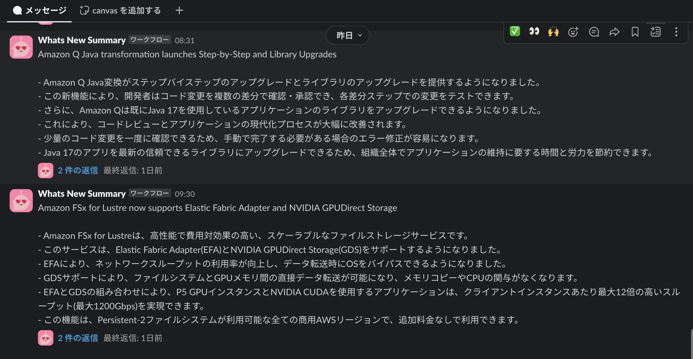

## はじめに

aws-samples の中に[Whats New Summary Notifier](https://github.com/aws-samples/whats-new-summary-notifier)というものがあり、
デフォルトだと AWS 最新情報 (What's New) の RSS を取得して、更新を claude-3-sonnet で要約して slack に通知してくれるものですが、
設定ファイルの変更のみで任意の RSS を取得して slack に通知できるように作られています。

こちらの導入ログと若干のカスタマイズを記載します。

## 導入

[README](https://github.com/aws-samples/whats-new-summary-notifier/blob/main/README_ja.md)そのままで動いたので手順は省略
唯一記載がなかった Slack のワークフロー設定だけ自分のものをペタリ。


動いてる様子はこんな感じ



## カスタマイズ

### 取得する RSSfeed の期日を変更

デフォルトだと直近 7 日分の更新を取得しているが、1 日分に変更した
[参考](https://github.com/niwanowa/whats-new-summary-notifier/pull/2/files)

さもなくば初回起動時に鬼のような通知に見舞われるだろう(pre:Invent 期間だったのもあるだろうけど...)


### モデルの変更

Claude 3 Sonnet が設定されているので Claude 3.5 Sonnet に更新。
ついでにデプロイ先のリージョンも東京に変更した。

料金と出力の形式が変わらないのでプログラム的な変更は不要。


(画像は東京リージョンじゃないけど値段は一緒)


[参考 1](https://github.com/niwanowa/whats-new-summary-notifier/pull/5)
[参考 2](https://github.com/niwanowa/whats-new-summary-notifier/pull/7)

### 購読する RSS の追加

cdk.json の context.notifiers 配下に AwsWhatsNew を複製する形で追記することで RSS の追加が可能。
ssm に webhook URL を増やせば通知先のチャンネルも増やせる。いいね。

```shell
aws ssm put-parameter \
 --name "<任意の値>" \
 --type "SecureString" \
 --value "<Webhook URL を入力>"
```

[参考](https://github.com/niwanowa/whats-new-summary-notifier/pull/11)

### 終わりに

基本的にそのままで利用できて BIG 感謝です。AWS さまさま。
唯一 ATOM に対応してなさそうだったので今度どうやったかを追記するかもしれん。
