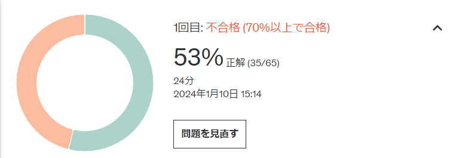

## AWS CLF合格記

AWS認定の登竜門的立ち位置であるAWS CLFを合格したので、合格記を書きます。
もともとAWSの勉強初めのころにSAAを取っていたのですが、失効してしまっていたので
改めてCLFから取得しました。
今回勉強にUdemyの「[これだけでOK! AWS認定クラウドプラクティショナー試験突破講座](https://www.udemy.com/course/ok-aws-e/)」と[Cloud License](https://cloud-license.com/)を使ったので、そのレビューも書きます。

昔からCloud Licenseって名前だったかしら

### プロフィール

AWS経験： 4年くらい
取得済み資格：なし
執行済み資格：SAA-C01

### 受験情報

受験日：2024/01/12
スコア：780/1000 (合格点：700)
受験回数：1回目
学習期間：3日
Udemyのコースに登録されている模擬試験2回分とCloud Licenseの問題304問分を解いたらしい

### 勉強方法の結論

[Cloud License](https://cloud-license.com/)の問題集を上から順番に説き続ける。

### [これだけでOK! AWS認定クラウドプラクティショナー試験突破講座](https://www.udemy.com/course/ok-aws-e/)」レビュー

所属している会社がUdemy Businessを導入していたのでとりあえず最初に手を付けた
AWSを初めて触るのなら、このコースのハンズオンを通しでやってから問題集を解くのが良いのかなと思った。

#### 良かった点

・このコース向けに作成されたハンズオン動画がある

#### 自分には合わなかった点

・ハンズオン動画の音質がかなり厳しい
・模擬試験の問題と選択肢の日本語が怪しい
・模擬試験の解説の日本語が怪しいときと、解説になっていない時がある
・模擬試験の解説の1次ソースが明示されないことが多い
・一問一答形式でなく、65問ぶっ続けで解いてから解説となるため、使い勝手がやや悪い（Udemyというプラットフォームの仕様上仕方ないと思うが）

### [Cloud License](https://cloud-license.com/)レビュー

udemyの講座であまりにも問題の日本語がおかしかったので他の方法を探してたどり着いた

ただひたすらに問題を解き続けることができるので、自分には合っていた
基本情報の過去問道場みたいな使い勝手

#### 良かった点

・より実践に近い問題分、選択肢であった
・一問一答形式で、すぐに解説が読める
・解説の1次ソースが明示されている
・問題数が多い(全部で546問ある)

#### 自分には合わなかった点

特になし
CLFに向けたハンズオンみたいなものはないので初学者にとっては敷居が高いか？

## おわりに

まぁ昔SAA取ってたしノー勉で大丈夫でしょ。みたいな気持ちで望んでいたけど、最初の模試の結果は悲惨そのものだった

無事合格できたのでよかったです。
