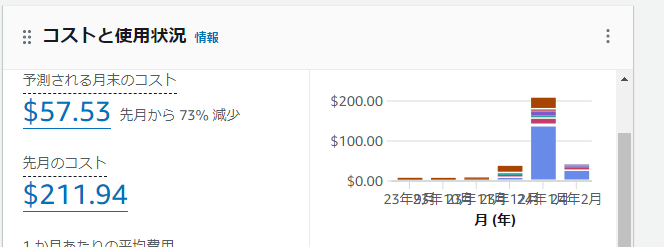

AWS EC2インスタンスで構築する。
AL2023はglibc.i686及びlibstdc++.i686を拾うのがめんどいのでAL2を使う。

<https://tech.palworldgame.com/dedicated-server-guide#linux>

[Link to SteamCMD](https://developer.valvesoftware.com/wiki/SteamCMD#Linux)

### サーバー設定

### よく使うコマンド

steamCMD
cd /home/ec2-user/Steam/

再起、停止、スタート、ステータス確認
sudo systemctl restart pal
sudo systemctl stop pal
sudo systemctl start pal
sudo systemctl status pal

### アップデート手順

cd /home/ec2-user/Steam/
./steamcmd.sh +login anonymous +app_update 2394010 validate +quit

引っかかったところメモ
・8GBだとボリューム不足で落ちる。

### 起動、停止用lambda構成

費用削減のため、起動、停止用のlambdaを作成した。

