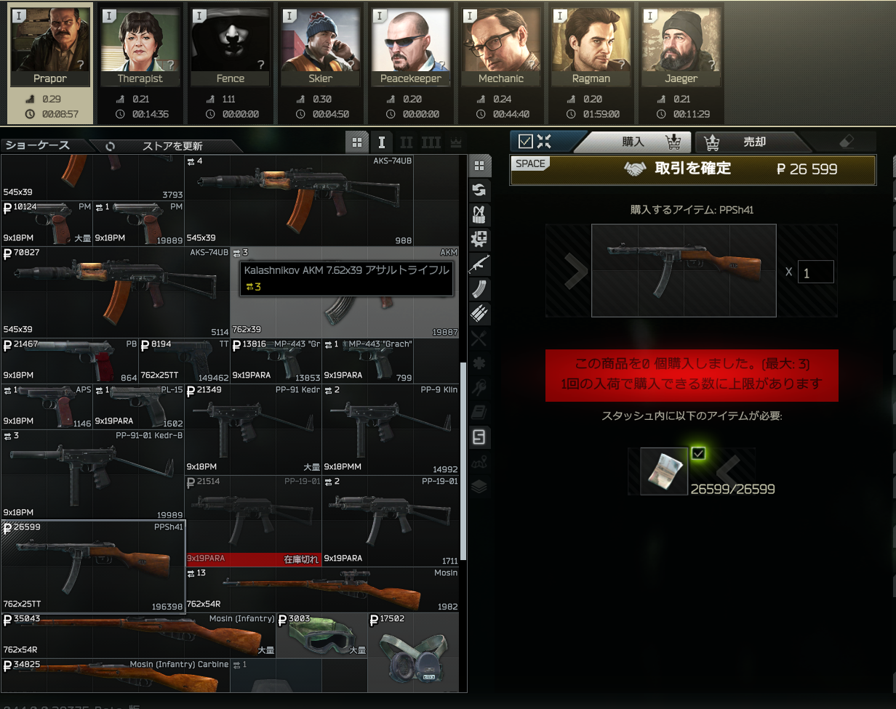
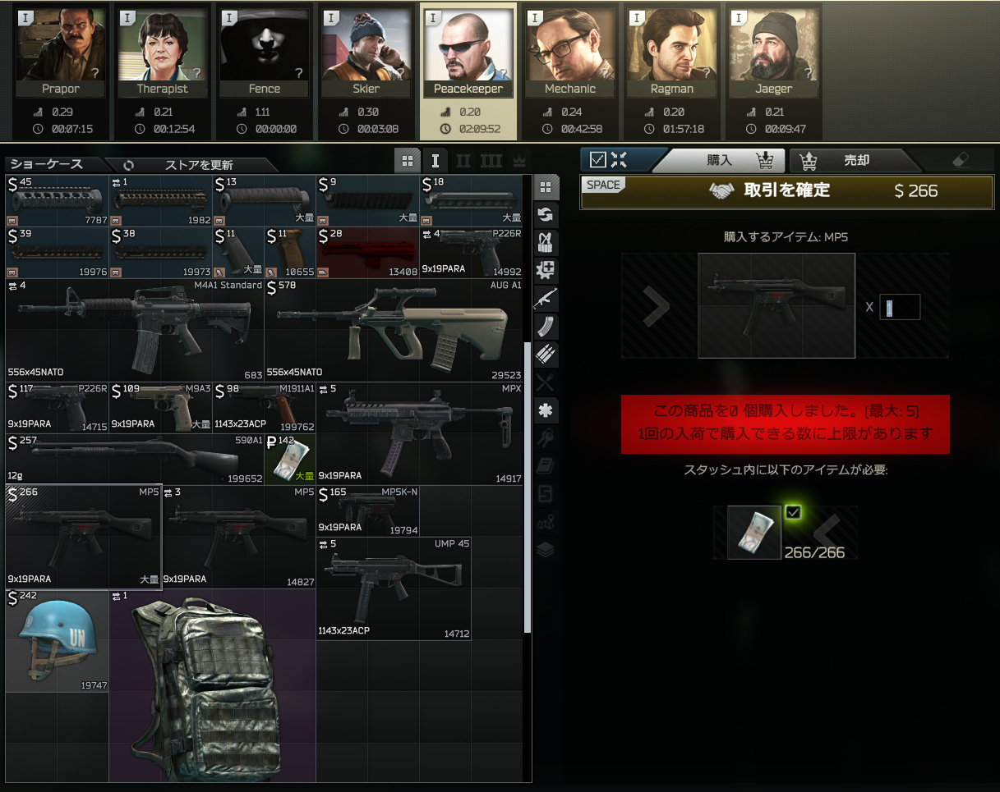

# v14で頭に入れるべき変更点
## GROUND ZERO追加
Lv20以下限定マップ  
従来のタスクの前にこのマップで4個くらいタスクをクリアする必要がある。  
体感CUSTOMの半分くらいのマップにCUSTOMと同じ10人～12人が詰め込まれる。  
タスクの都合上、全員がTerraGroupに向かうと思ってよいので戦闘は必ず起こると思ってよい。  

## リコイルの変更
縦反動が大きく減少した。  
今季はとにかく高レートの武器を持て！  
敵と戦うときはエイムしながら撃て！  
エイムしながらピークしろ！  

# とりコレ装備
**GROUND ZEROでタスクするときはどうせ死ぬので安い装備でいいと思う**  
## 武器
- PPsh41 ₽26599 Prapor LL1 ~ 

弾：7.62x25mm TT AKBS ₽54  
今期のリコイル変更を感じれる武器  
覗いて撃ってみろ  
サイトが載せられないこと、アイアンサイトが少し見にくいことが難点だけど強い

- MP5 $266 (=₽37772 ) Peacekeeper LL1 ~

弾：9x19mm Green Tracer ₽73  
多分今のメタ  
メインで使ってるけど多分強い  

# タスク
基本的にwikiで必要十分な情報が出そろってるが  
以下の動画を一度見ておくとよいと思う  
